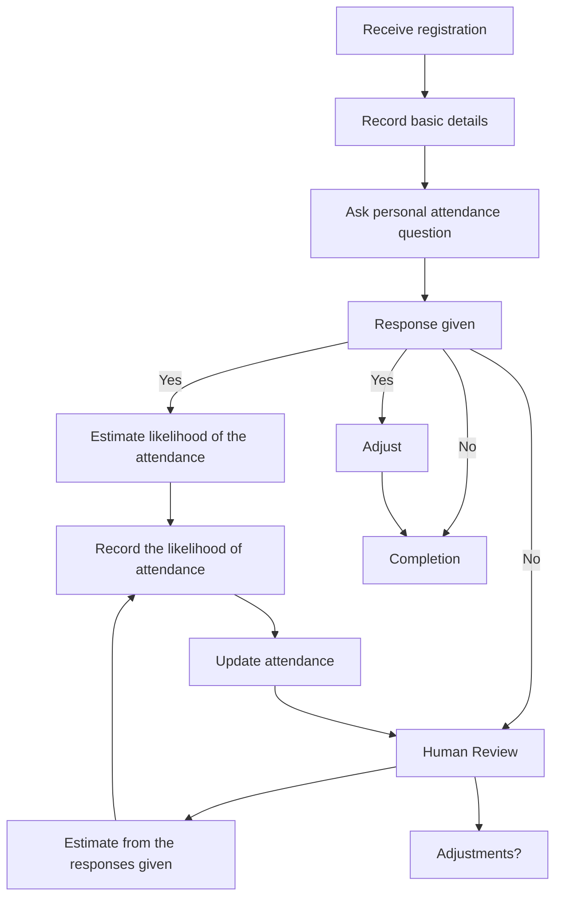

# Workflow of Tasks

*Replace all bracketed prompts with information specific to your proposed system. Delete instructional text that does not belong in your final specification. Add or remove task sections as needed. Every task shown in the general workflow must have a corresponding task specification below.*

## 1. Workflow Overview
### 1.1 Workflow Goal
This workflow supports the system goal defined in `my_first_agent/README.md`.

### 1.2 Workflow Trigger

A student will submit a registration for the CPVC Hackathon

### 1.3 Completion Condition at Runtime

When a student has submitted their registration it should be recorded into the attendance and end state would be when the attendance is updated.

### 1.4 General Workflow

When a student submits their Hackathon registration, the system will only record basic information like their name and asks one optional questions that is more personal. It will use the responses to forecast the likelihood of the person actually attending the event. By using the responses and the patterns of the individual. However, if the student doesn't answer the optional question regarding attendance then the system will use what it has. And organizers can review the system to accurately estimate the swag, food, drinks. The run ends when the attendance is updated 

### 1.5 Workflow Diagram

